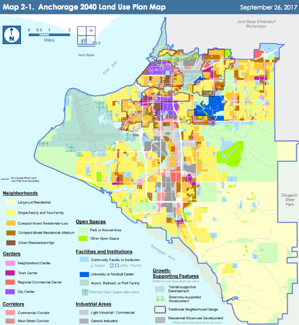

```{r setup, include=FALSE, eval = TRUE}
library(xaringan)
options(htmltools.dir.version = FALSE)
```

class: center

### Visualization 1


Image credit: [Matt Bailey](https://16z85b2i19wn1kkcfv2qhbu3-wpengine.netdna-ssl.com/wp-content/uploads/2007/02/star-trek-graph.png)
---
class: center

### Visualization 2
```{r, echo = FALSE, out.height = 500, out.width = 450}

```

Image credit: [Alaska Public Media](https://www.alaskapublic.org/wp-content/uploads/2019/02/2040-LUP-mapWEB.jpg)

